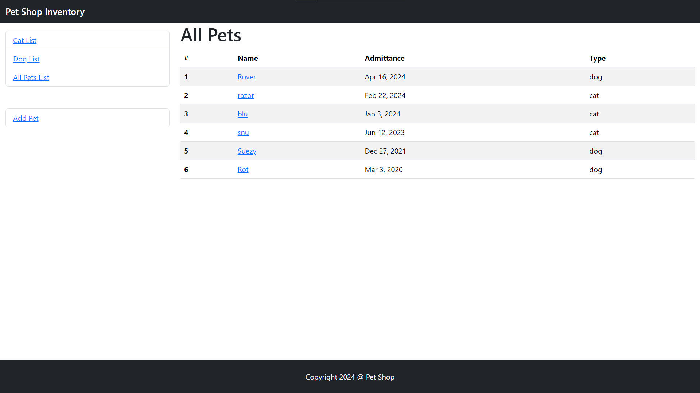
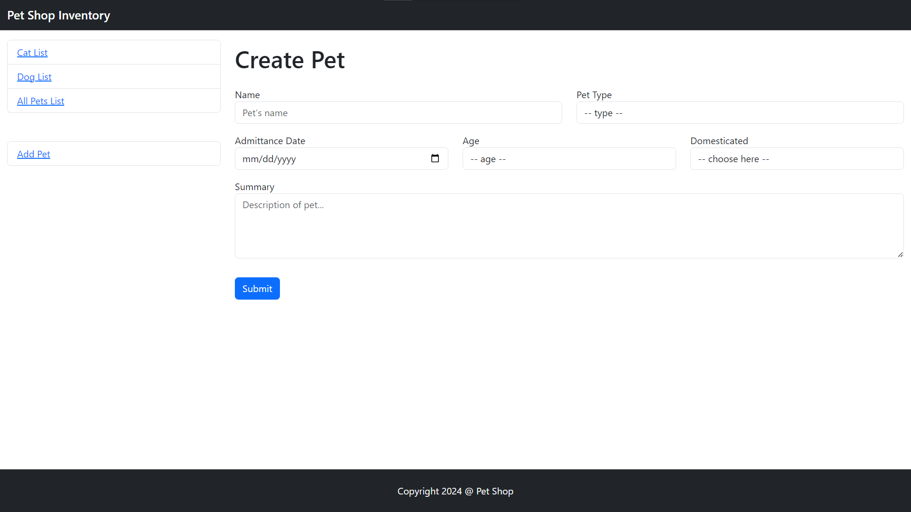
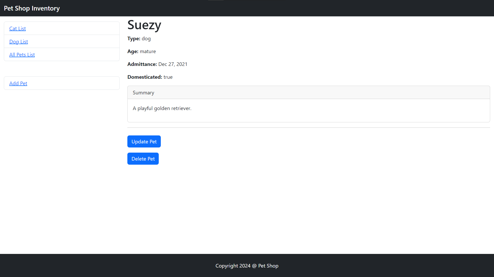

# Pet Shelter Inventory

A website for a fake pet shelter where they can inventory their pets.

*It is a fullstack website with all the CRUD operations.*

**Live demo [link](https://evening-depths-42153-e2ec182cd86e.herokuapp.com/inventory)**. 👈

### Technology Used
- Express
- Pug
- Bootstrap
- Mongoose (MongoDB)
- Heroku
- JavaScript

# Screenshots

# Commands
To start up the local development server: `npm start`

For heroku to start up the app: `npm run startHeroku`